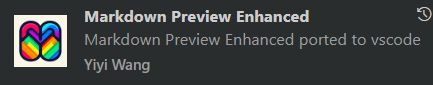

# Projeto de Treinamento - Beets Jr


Dica inicial: baixem essa extensão para melhor visualizar os arquivos markdown

# Introdução

Este é um projeto estruturado para o aprendizado de desenvolvimento web full-stack, dividido em `frontend` (React) e `backend` (Node.js/Express).

Cada frente de trabalho, apesar de independente, trabalhará **sobre o mesmo projeto**.

## 🤝 A Colaboração Essencial

Certo, mas o que isso quer dizer na prática? A colaboração entre desenvolvedores `frontend` e `backend` é crucial. Vamos analisar um cenário comum:

> **O Dilema do Frontend**
>
> Se o meu projeto é uma To-Do list, como eu faria para exibir as tarefas de um determinado usuário no `frontend`?
>
> - *De onde vêm esses dados?* (Você já imaginou: do banco de dados).
> - *Mas e aí? Eu, como dev front, consulto diretamente o banco? Como se faz isso?*
>
> Bom, há um motivo para não se ter conteúdos muito específicos sobre bancos de dados na trilha de `frontend`. A chave para essa comunicação é a **API** desenvolvida no `backend`!

---

## ⚙️ O Fluxo de Comunicação

Para entender como a mágica acontece, saiba que o `README.md` na pasta `frontend/src/services` detalha o processo. De forma resumida, o fluxo é o seguinte:

1.  **Necessidade (Frontend):** O `frontend` precisa de um dado ou quer executar uma ação (ex: criar uma nova tarefa).
2.  **Requisição (Frontend → Backend):** Ele faz uma requisição para o `backend` por meio de uma **rota**, acessível em uma URL e porta específicas (onde o servidor evidentemente deverá estar rodando).
    - Exemplo: `http://localhost:3001/api/tasks`
3.  **Processamento (Backend):** O `backend` recebe a requisição, trata os dados, realiza as operações necessárias no banco de dados e prepara uma resposta.
4.  **Resposta (Backend → Frontend):** O `backend` envia a resposta (os dados solicitados ou uma confirmação) de volta para o `frontend`, que finalmente pode usá-la para exibir em tela!

## 📝 Exemplo Prático

> Aha! Isso quer dizer, obviamente, que os devs `back` precisarão informar os devs `front` sobre quais **rotas** estão disponíveis!
>
> **Cenário: Listar as tarefas de um usuário.**
>
> - **Necessidade do Front:** Precisa da lista de tarefas do usuário com `id = 123`.
> - **Solução do Back:** Cria a rota `GET /tasks/:id`, onde `:id` é o identificador do usuário.
> - **Ação do Front:** Faz uma requisição para a URL `http://localhost:3001/api/tasks/123`.
> - **Resultado:** O `backend` processa a requisição, busca as tarefas do usuário `123` no banco e retorna um objeto (provavelmente um vetor de tarefinhas) com todas as tarefas dele.

---

## ⚠️ Não se Esqueçam Disso!

Eis a comunicação entre vocês!

Este é um projeto simples, então a probabilidade de falha de comunicação é relativamente baixa. Mas imagine o que acontece se não estiver claro que o identificador do usuário na rota `/tasks/:id` é o seu **ID numérico** e não o seu **nome de usuário**. O `frontend` faria a requisição errada, o usuário não seria encontrado no banco e a aplicação não funcionaria como esperado.

Comuniquem-se!

## Metodologia de Aprendizado

### Estratégia dos TODO's

Este projeto utiliza uma **metodologia baseada em TODO's** para guiar o aprendizado de forma progressiva:

#### 📝 Como Funciona:
- **Arquivos com TODO's:** Cada arquivo contém comentários TODO que indicam exatamente o que implementar
- **Explicações Didáticas:** Comentários detalhados explicam o propósito e funcionamento de cada parte
- **Objetivos Numerados:** Cada arquivo é dividido em objetivos claros e sequenciais
- **Exemplos de Código:** Quando necessário, exemplos são fornecidos para orientar a implementação

#### 🔍 Exemplo da Estrutura:
```javascript
// TODO: Importe o React e outras dependências necessárias

/**
 * Explicação detalhada do propósito do arquivo
 * e conceitos importantes
 */

// 🎯 Objetivo 1: Criar o componente
// TODO: Implemente a função do componente

// 🎯 Objetivo 2: Gerenciar estado
// TODO: Use useState para controlar os dados

// 🎯 Objetivo 3: Implementar lógica
// TODO: Crie as funções necessárias
```

## 🧱 Construindo Sobre a Base: A Estrutura de Arquivos

Ao explorar o projeto, vocês notarão que já existe uma estrutura inicial de arquivos e pastas. Grande parte dela está focada em **Usuários** (`users`). Por que isso?

Simples: a funcionalidade de usuário (login, registro, etc.) é um denominador comum, uma base necessária para os 3 projetos. Pensem nisso como o alicerce da nossa construção e um presente meu pra vocês :)

### A Missão de Vocês: Dar Vida ao Tema da Equipe

Esse alicerce é apenas o começo. A principal tarefa de vocês é **expandir essa estrutura para implementar o tema específico da sua equipe**. Isso significa que novas pastas e arquivos serão criados por vocês para dar corpo ao projeto.

> **Exemplo Prático: Equipe do "Blog"**
>
> - **Onde?** Na pasta `frontend/src/components/`.
> - **O quê?** A equipe criará uma nova pasta chamada `Blog`.
> - **Dentro dela?** Todos os arquivos relacionados ao blog. O mesmo se aplicaria para pastas como `pages`, `hooks`, e assim por diante.

### ⚠️ A Regra de Ouro: Consistência!

Percebam que a estrutura inicial segue um padrão (ex: `pages`, `components`, `services`). A diretriz mais importante é: **mantenham esse padrão!**

Se a equipe do Blog criar um serviço para buscar posts na API, ele deve ir para a pasta `services`, e não ficar solto dentro da pasta de componentes. A organização é fundamental para a sanidade do projeto (e a dos seus colegas!).

### Estrutura do Projeto

```
projeto/
├── backend/           # Node.js + Express
│   └── functions/
│       └── src/
│           ├── config /       # Configuração do Firebase 
│           ├── controllers/   # Lógica de negócio
│           ├── middlewares/   # Autenticação e validação
│           ├── repositories/  # Acesso a dados
│           ├── routes/        # Endpoints da API
│           └── services/      # Regras de negócio
└── frontend/          # React + Vite
  ├── src/
  │   ├── components/    # Componentes reutilizáveis
  │   ├── contexts/      # Context API (autenticação)
  │   ├── hooks/         # Hooks personalizados
  │   ├── pages/         # Páginas da aplicação
  │   ├── routes/        # Configuração de rotas
  │   └── services/      # APIs e Firebase
  └── README.md
```

-----

## 🔥 Configuração do Ambiente de Desenvolvimento

Para iniciar o ambiente de desenvolvimento, siga os passos abaixo para cada parte do projeto. Note que absolutamente todos os desenvolvedores farão esse passo.

### Instalação de Dependências

É necessário instalar todas as dependências listadas nos arquivos `package.json` tanto para o frontend quanto para o backend.

  * **Backend:** Navegue até a pasta `backend/functions` e execute o seguinte comando:

    ```bash
    npm install
    ```

  * **Frontend:** Navegue até a pasta `frontend` e execute o seguinte comando:

    ```bash
    npm install
    ```

### Configuração das Variáveis de Ambiente

Ambos, frontend e backend, necessitam de um arquivo de configuração de ambiente (`.env`) para armazenar as credenciais do Firebase. Estes arquivos deverão ser criados na raiz das pastas `frontend` e `backend/functions`.

#### Credenciais do Frontend

As credenciais do frontend podem ser encontradas no console do Firebase.

1.  Acesse o [console do Firebase](https://console.firebase.google.com/).
2.  Selecione o seu projeto.
3.  Clique no ícone de engrenagem (Configurações do projeto) no menu lateral esquerdo.
4.  Na aba "Geral", role para baixo até a seção "Seus apps".
5.  Selecione o seu aplicativo da web.
6.  Em "SDK do Firebase", clique em "Configuração".
7.  Copie o objeto de configuração do Firebase e adicione as variáveis correspondentes ao seu arquivo `.env` na pasta `frontend`. Note que ficará como o arquivo `.env.example`, porém com as variáveis do seu projeto.

**Exemplo de `.env` para o frontend:**

```
VITE_FIREBASE_API_KEY=sua_api_key
VITE_FIREBASE_AUTH_DOMAIN=seu_auth_domain
VITE_FIREBASE_PROJECT_ID=seu_project_id
VITE_FIREBASE_STORAGE_BUCKET=seu_storage_bucket
VITE_FIREBASE_MESSAGING_SENDER_ID=seu_messaging_sender_id
VITE_FIREBASE_APP_ID=seu_app_id
```

#### Credenciais do Backend (Service Account)

As credenciais do backend são geradas a partir de uma "service account" (conta de serviço) no Firebase, que permite o acesso do servidor aos recursos do Firebase.

1.  Acesse o [console do Firebase](https://console.firebase.google.com/).
2.  Selecione o seu projeto.
3.  Clique no ícone de engrenagem (Configurações do projeto) no menu lateral esquerdo.
4.  Selecione a aba "Contas de serviço".
5.  Clique no botão "Gerar nova chave privada".
6.  Um arquivo JSON contendo suas credenciais será baixado. **Guarde este arquivo em um local seguro, pois ele concede acesso de administrador ao seu projeto.**
7.  Renomeie o arquivo para `serviceAccountKey.json` e coloque-o em um local seguro dentro do seu projeto backend. Adicione o caminho para este arquivo no seu `.env` na pasta `backend/functions`.

**Exemplo de `.env` para o backend:**

```
GOOGLE_APPLICATION_CREDENTIALS=./caminho/para/seu/serviceAccountKey.json
```

-----

## Backend

O backend, localizado na pasta `backend/functions`, é desenvolvido em **JavaScript** utilizando o framework **Express.js**.

### Arquitetura MVC

O projeto segue a arquitetura **Model-View-Controller (MVC)**, um padrão de design que separa a aplicação em três componentes principais, promovendo um código mais organizado, manutenível e escalável.

  * **Model (Modelo):** É a camada responsável pela lógica de negócios e pela manipulação dos dados. Interage diretamente com o banco de dados para buscar, criar, atualizar e deletar informações. Em nosso projeto, os modelos definem a estrutura dos dados.

  * **View (Visão):** No contexto de uma API REST, a "View" é a representação dos dados, geralmente em formato JSON, que é enviada como resposta ao cliente. Esta camada é responsável por apresentar os dados do modelo.

  * **Controller (Controlador):** Atua como o intermediário entre o Modelo e a Visão. Ele recebe as requisições do cliente ( vindas das rotas), aciona os métodos apropriados no Modelo para processar os dados e, em seguida, seleciona a Visão para renderizar a resposta final que será enviada ao cliente.

### Componentes Adicionais

  * **Middleware de Autenticação:** Existe um middleware para verificar a autenticação do usuário antes de permitir o acesso a rotas protegidas.
  * **Rotas da API:** As rotas definem os endpoints da API, mapeando as requisições HTTP para as funções correspondentes nos controladores.

-----

## Frontend

O frontend é desenvolvido em **React** com **Vite**, utilizando uma abordagem simplificada para facilitar o aprendizado.

### 🛠️ Tecnologias Utilizadas

- **React** - Biblioteca para interfaces de usuário
- **React Router DOM** - Navegação entre páginas
- **Firebase** - Autenticação de usuários
- **Axios** - Requisições HTTP para o backend
- **Vite** - Ferramenta de build e desenvolvimento

### 📚 Funcionalidades para Implementar

Vocês implementarão as seguintes funcionalidades seguindo os TODO's:

#### 🔐 Sistema de Autenticação
- **Context API** para gerenciar estado global do usuário
- **Login/Registro** integrado com Firebase
- **Rotas protegidas** que requerem autenticação
- **Hook personalizado** para acessar dados de autenticação

#### 🌐 Integração com Backend
- **Cliente HTTP** configurado com interceptors automáticos
- **CRUD de usuários** com interface completa
- **Tratamento de erros** e feedback visual
- **Sincronização** entre Firebase e backend

#### 🧩 Componentes e Páginas
- **Páginas principais:** Login, Registro, Dashboard, Usuários
- **Componentes reutilizáveis:** Formulários, modais
- **Navegação dinâmica** baseada no estado de autenticação
- **Estilização simples** com CSS inline (sem bibliotecas complexas).  Se desejar, use um arquivo de estilos separado, mas na mesma pasta.